# Health Application
From Symptoms to Disease Diagnosis, Recommendation,  Monitoring, and Follow up

This project is the graduation project of Derya Nur Çaman, Kerem Kepenek, Sinan Altınayak and Tuğçe Yenisey Erkan from Istanbul Medipol University.

## Objective of the Project

Our project intends to accurately identify the diseases of patients by examining their symptoms, using a machine learning model. Furthermore, through enabling physician-patient interaction, we hope to provide accurate guidance to patients regarding their condition allowing both artificial intelligence and the physician to securely counsel the patient. It is also intended to suggest an effective treatment for the diseases. Our program aims to find nearby hospitals and be able to monitor the patient instead of just diagnosing and prescribing treatments. We aim to maintain track of the progression and recovery of the disease.

## What can be done with this project?

Patient users can:

- identify their disease by selecting symptoms
- get recommendation according to their disease
- send their tests to the physicians
- observe their test history
- monitor themselves by entering their vital values
- chat with their physicians
- see nearby hospitals around their location
- store their medical history and necessary information

Physicians can:

- see the test results of patients
- observe diagnosis recommendation, vital values, medical history of patients
- finalize test of patients by choosing their disease
- redirect patients' tests to another medical department
- start a chat to thoroughly diagnose the patients
 

## Gallery

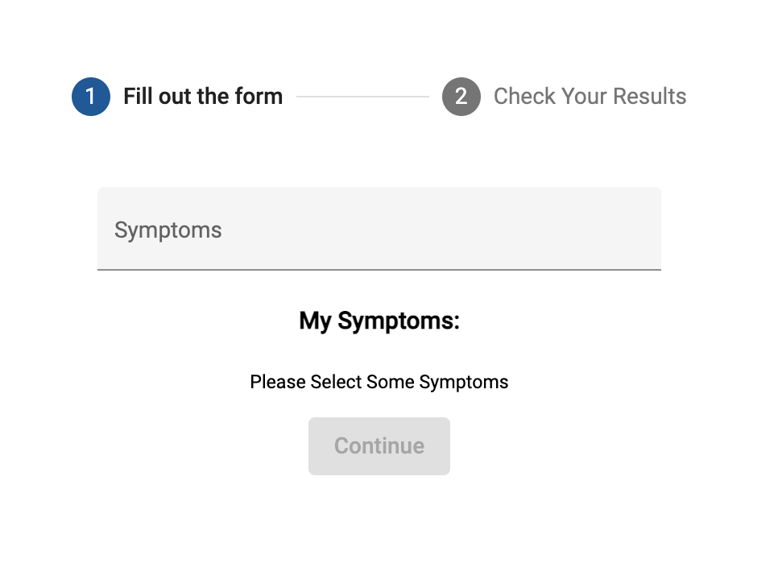

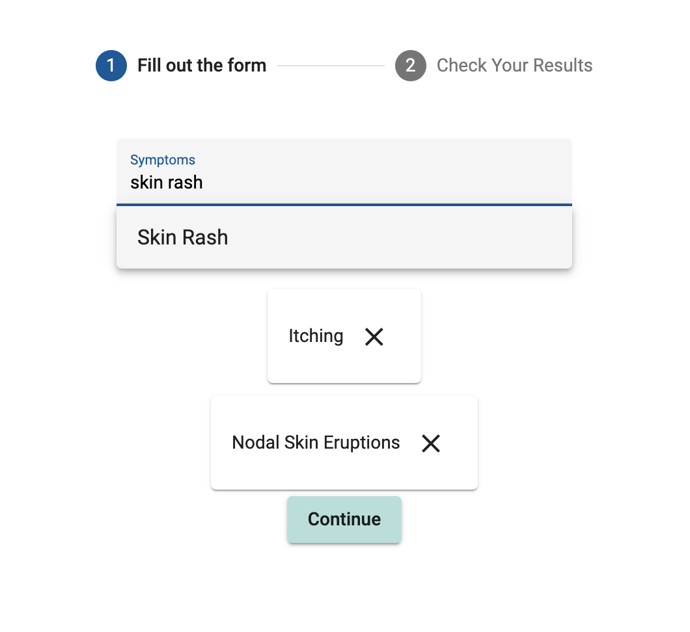

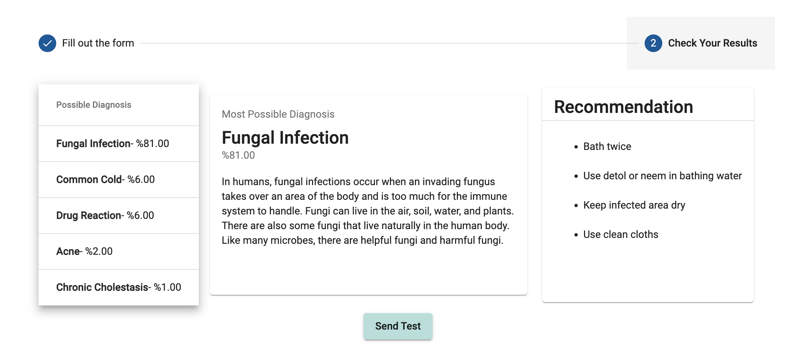

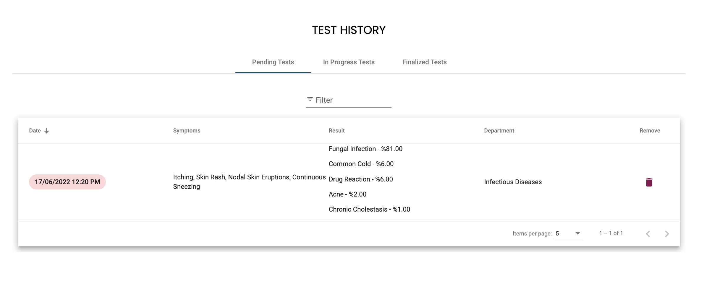

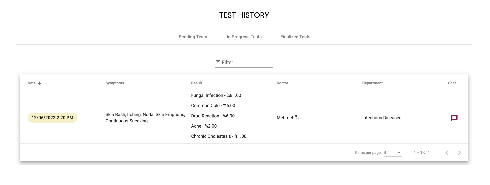

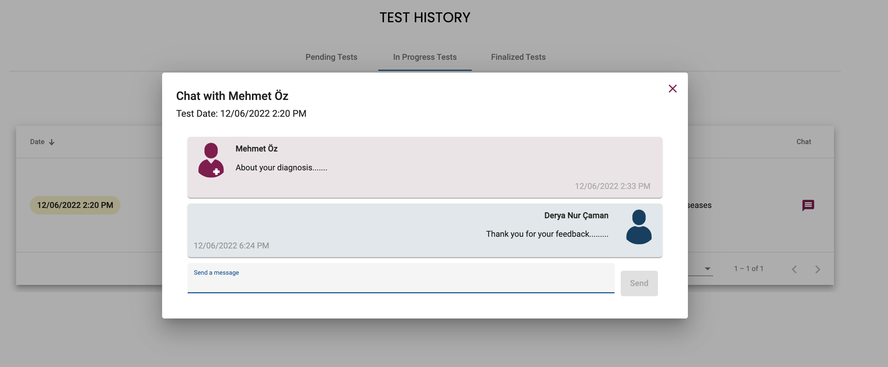

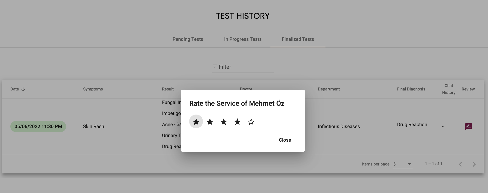

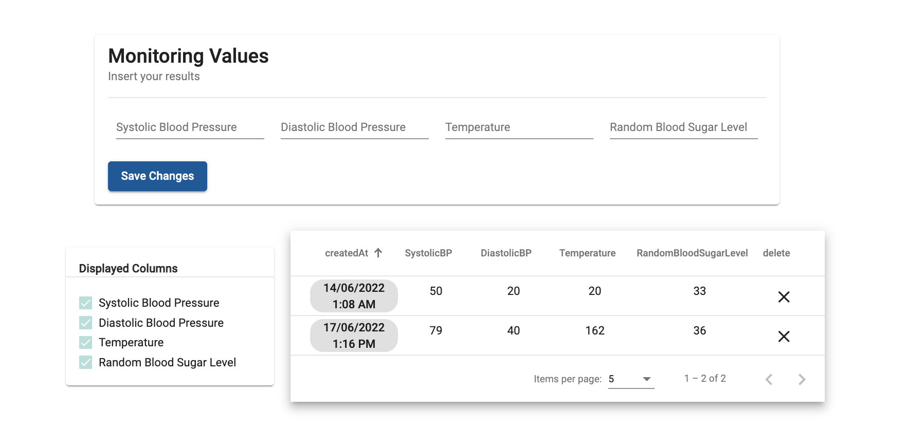

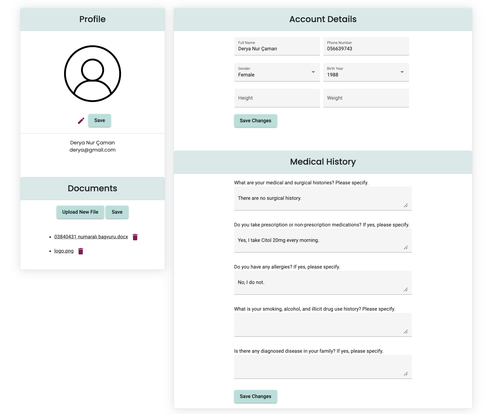

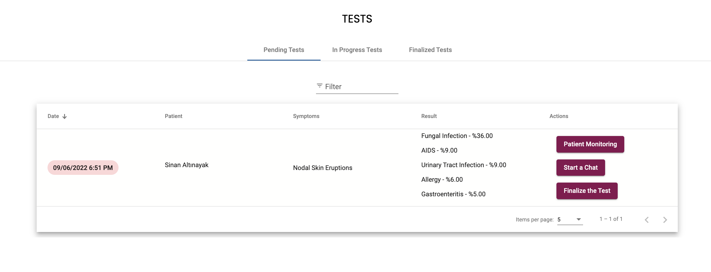

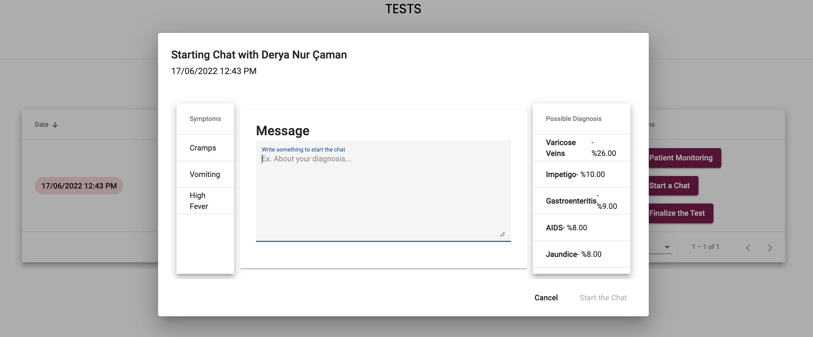

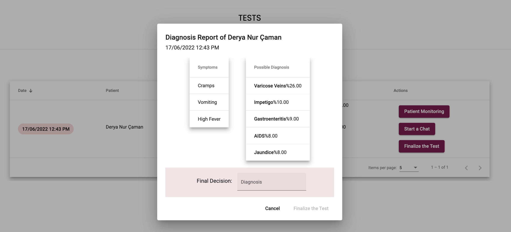

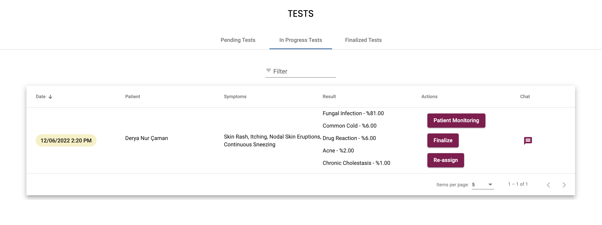

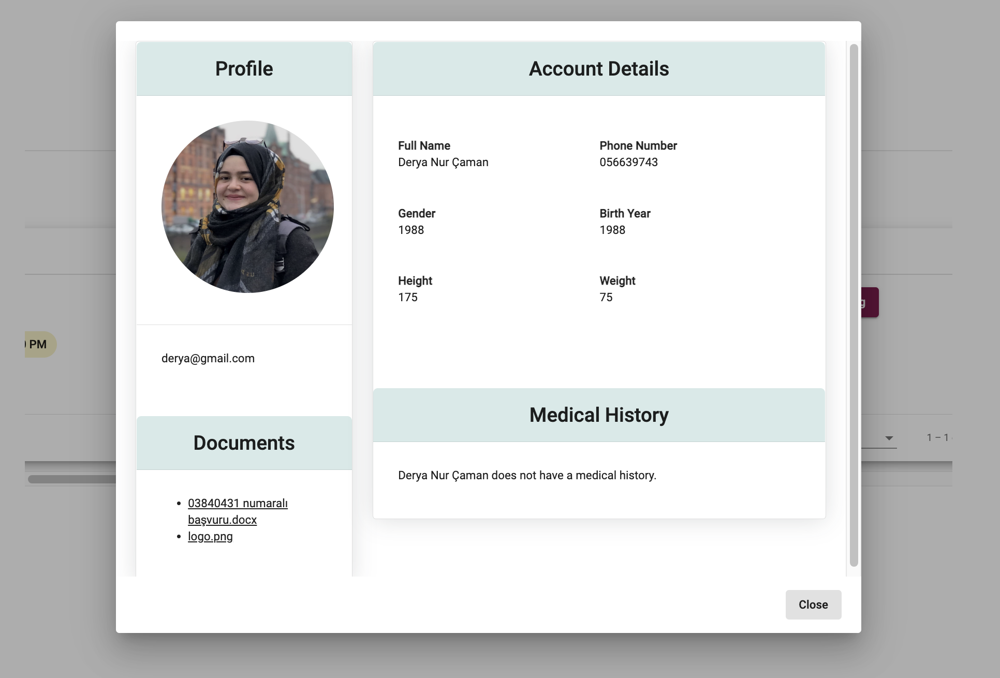

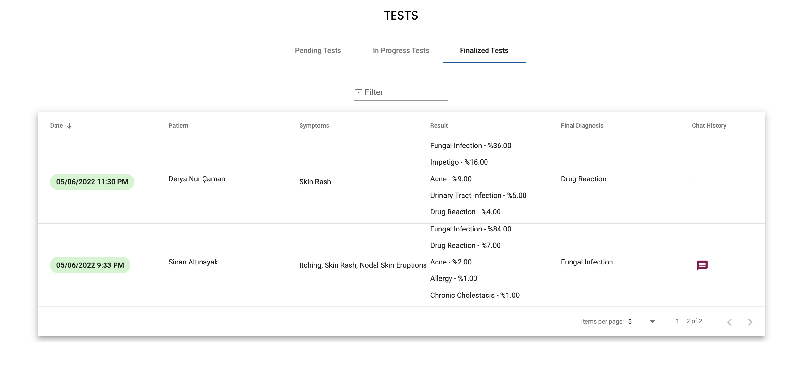

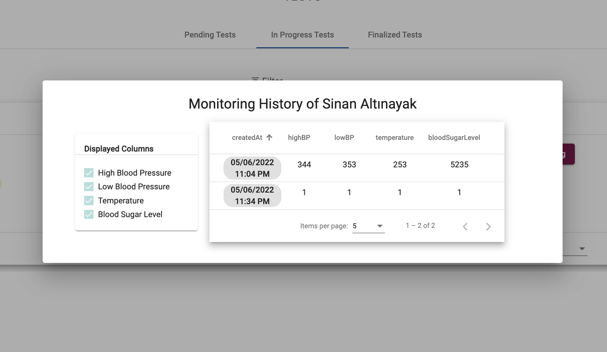

